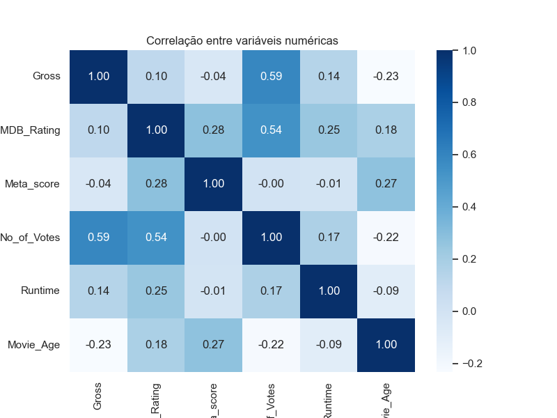
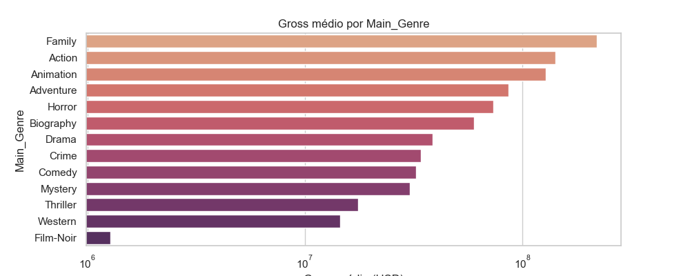

# Desafio de Ciência de Dados: Análise Preditiva para a Indústria Cinematográfica

## 1. Contexto do Projeto

Este projeto foi desenvolvido como solução para o Desafio de Cientista de Dados da Indicium (Lighthouse). O objetivo é atuar como uma consultoria para o estúdio de Hollywood "PProductions", utilizando uma base de dados de filmes para extrair insights e construir modelos preditivos que orientem a tomada de decisão sobre futuras produções. O projeto segue a metodologia CRISP-DM.

## 2. Resumo Executivo das Descobertas

A análise dos filmes de maior sucesso revelou fatores claros que impulsionam o sucesso financeiro e de crítica, culminando em modelos preditivos de alta performance.

* **Faturamento é guiado por Gênero e Popularidade:** O modelo preditivo para faturamento (`R²=0.616`) apontou que o gênero **Aventura** é o fator de maior impacto, seguido pelo **engajamento do público** (`No_of_Votes`). Filmes mais recentes também tendem a faturar mais.
* **Modelo de Rating com Alta Precisão:** Foi desenvolvido um modelo para prever a nota do IMDB com um **erro médio de apenas 0.14 pontos** na escala de 1 a 10 (`MAE=0.137`), demonstrando alta confiabilidade para avaliar o potencial de recepção de um filme.
* **Previsão para "The Shawshank Redemption":** Utilizando o modelo final, a nota prevista para um filme com as características do exemplo foi de **9.06**.

Abaixo estão duas das principais visualizações que suportam nossas conclusões sobre os fatores de sucesso financeiro:


*<p align="center">A matriz de correlação evidencia que a popularidade (`No_of_Votes`) é o fator mais correlacionado com o faturamento (`Gross`).</p>*


*<p align="center">O gráfico de barras mostra que os gêneros de Familia e Ação lideram em faturamento médio.</p>*

## 3. Estrutura do Repositório

O projeto está organizado da seguinte forma:

```
├── data/                 # Contém os datasets brutos e processados
│   ├── raw/
│   └── processed/
│   └── external_data/  # Dados adicionais obtidos de fontes externas
├── documentacao_tecnica/        # Documentos .md de cada fase do CRISP-DM
├── models/               # Modelos treinados salvos no formato .pkl
├── notebooks/            # Jupyter Notebooks com todo o desenvolvimento
├── reports/              # Contém relatórios e figuras geradas
│   ├── figures/
├── └── resumos_executivos/
├── README.md             # Este documento
└── requirements.txt      # Lista de dependências do projeto
```

## 4. Como Executar o Projeto

Para replicar a análise e os resultados, siga os passos abaixo:

1.  **Clonar o Repositório:**
    1.  **Clonar o Repositório:**
    ```bash
    git clone https://github.com/Haell39/LH_CD_Rafael_Dutra
    cd LH_CD_Rafael_Dutra
    ```

2.  **Criar e Ativar um Ambiente Virtual:**
    ```bash
    # Criar o ambiente
    python -m venv .venv

    # Ativar no Windows
    .\.venv\Scripts\activate

    # Ativar no macOS/Linux
    source .venv/bin/activate
    ```

3.  **Instalar as Dependências:**
    ```bash
    pip install -r requirements.txt
    ```

4.  **Executar os Jupyter Notebooks:**
    Inicie o Jupyter e execute os notebooks na seguinte ordem:
    ```bash
    - `01_EDA_inicial.ipynb`
    - `02_EDA_detalhada.ipynb`
    - `preparacao_dos_dados.ipynb`
    - `03_EDA_Insights_dados_processados.ipynb`
    - `modelagem_avaliacao.ipynb`
    - `analise_externa_e_ROI.ipynb`
    ```

## 5. Respostas às Perguntas do Desafio

* **Qual filme você recomendaria para uma pessoa que você não conhece?**
    * Um filme que combine alta avaliação de público e crítica com gêneros de grande apelo, como **Família**, **Aventura** e **Ação**. Um exemplo do dataset seria "Coco" ou "A Viagem de Chihiro".
* **Quais são os principais fatores para um alto faturamento?**
    * O fator de maior impacto é o gênero **Aventura**, seguido pela **popularidade** (`No_of_Votes`).
* **É possível inferir o gênero a partir da `Overview`?**
    * Sim, mas com baixa confiabilidade. A análise mostrou que a sinopse sozinha não é um bom preditor quantitativo dos múltiplos gêneros de um filme.
* **Como foi feita a previsão da `nota do IMDB`?**
    * Tratei como um problema de **Regressão**. O modelo final, um **`XGBoost Regressor`** otimizado, utilizou todas as features numéricas e os gêneros. A métrica principal de avaliação foi o **MAE (Mean Absolute Error)**, por sua fácil interpretação. O modelo final obteve um `MAE` de **0.137**.
* **Supondo um filme com as características [de "The Shawshank Redemption"], qual seria a nota do IMDB?**
    * Utilizando o modelo final e otimizado, a nota prevista foi de 9.06.

---

## 🚀 Bônus: Aplicação Interativa com Streamlit

Para ir além da análise estática e proporcionar uma forma interativa de explorar os dados e insights deste projeto, desenvolvi uma aplicação web simples utilizando a biblioteca Streamlit.

Esta ferramenta permite que qualquer usuário pesquise e visualize as principais métricas de sucesso de todos os 999 filmes analisados, incluindo os dados enriquecidos de orçamento e o cálculo de Retorno Sobre o Investimento (ROI).

**Este aplicativo é um entregável adicional que demonstra a capacidade de transformar uma análise de dados em um produto interativo e de fácil consumo.**

### **➡️ Acesse a aplicação ao vivo no link abaixo:**

### [https://explorador-filmes-rafael-dutra.streamlit.app/](https://explorador-filmes-rafael-dutra.streamlit.app/)
OBS: A aplicação é hospedada em um serviço gratuito e pode entrar em repouso após um período de inatividade. Se isso acontecer basta clicar no botão "Yes, get this app back up" para "acordar" o app!